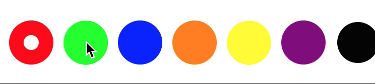

# EJVColorPicker

A cute little color picker control for iOS, written in Swift 3.

## Example 

  

## Usage

Create an instance of EJVColorPicker either programmatically or in Interface Builder. Then, to set the colors:

    colorPicker.colors = [ UIColor.red, ... ]

To get the user's selection, use the `selectedColor` property. Furthermore, there is a delegate callback for when the selected color changes:

    colorPicker.delegate = self
    
    ...

    func colorPicker(_ view: EJVColorPicker, didSelect color: UIColor) {
        // Handle selection
    }

## Installation

Simply include EJVColorPicker.swift into your Xcode project. 
